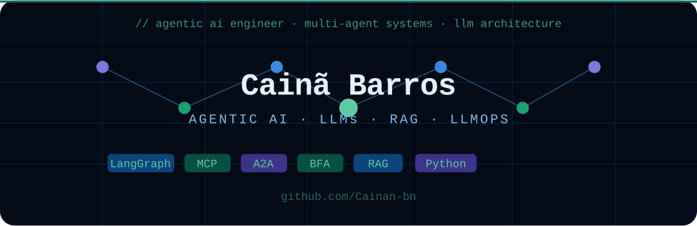

### Full Stack Developer in training

---

## Sobre mim

Desenvolvedor Full Stack em formação com especialização focada em Engenharia de
IA, Machine learning, automação de fluxos e criação de agentes inteligentes. Sólido domínio em Python,
JavaScript e TypeScript para o desenvolvimento de APIs escaláveis e integradas.
Experiência prática na implementação de arquiteturas RAG e orquestração de LLMs
utilizando LangChain e LangGraph. Minha trajetória anterior em operações industriais
complexas consolidou forte disciplina técnica, foco em código limpo, documentação
detalhada e resiliência para resolver problemas sob pressão.

---
## Formação Acadêmica
Graduação em **Desenvolvimento Full Stack** |
Universidade Estácio de Sá | Em Andamento  
Formação em Engenharia de Agentes de IA |
Alura | Conclusão prevista: Setembro/2026 

## Cursos Complementares
LangChain : Criando Chatbots Inteligentes com RAG  (Alura) 
LangChain e Python : Criando ferramentas com OpenAI  (Alura) 
Python: Inteligência Artificial Aplicada.  (Alura) 
Arquiteturas RAG com LLMs: embeddings, busca semântica e
criação de agentes com LangChain (Alura) 
Pensamento Computacional (Alura) 
Desenvolvimento Back-End .NET (Alura) 
MySQL -   (Gustavo Guanabara)

---

## Stack Técnica

### 🤖 AI, LLMs & Dados

**Conceitos:** RAG Pipelines · Prompt Engineering · Structured Output · Agentes de IA · Embeddings · Observabilidade de LLMs (tokens, latência, custo) · Multi-agent Orchestration

---

### ⚙️ Backend & Arquitetura

**Conceitos:** Clean Architecture · SOLID · Strategy Pattern · Repository Pattern · Retry/Backoff (tenacity) · Background Tasks · Pydantic v2 · Structured Logging (structlog)

---

### 🖥️ Frontend

**Conceitos:** Standalone Components · Reactive Forms · DI · Lifecycle Hooks · Lazy Loading · Tipagem estrita

---

### 🛠️ Banco de Dados, DevOps & Ferramentas

---
 
 

