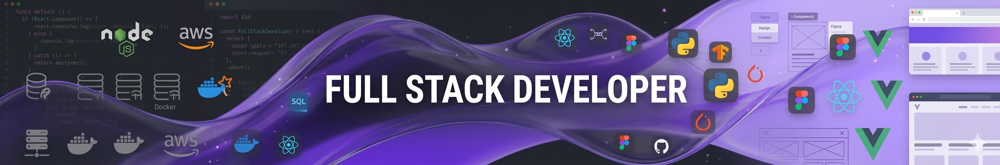

  

# 👋 Olá, eu sou o Cainã

🚀 Desenvolvedor focado em **Full Stack Development, Engenharia de IA, Dados e Sistemas Baseados em LLMs**

Minha jornada profissional começou na indústria como **Soldador Sênior**, trabalhando em grandes estruturas e projetos de alta responsabilidade.

Hoje estou em transição para tecnologia com um objetivo claro: **construir sistemas inteligentes baseados em IA que resolvam problemas reais**.

Essa mudança de carreira trouxe comigo habilidades importantes:

- disciplina
- pensamento analítico
- resolução de problemas complexos
- responsabilidade em ambientes críticos

Hoje aplico tudo isso no desenvolvimento de **aplicações com Inteligência Artificial e sistemas escaláveis.**

---

# 🧠 Áreas de atuação

💻 **Desenvolvimento Full Stack**  
🤖 **Engenharia de aplicações com LLMs**  
📊 **Análise e processamento de dados**  
⚙️ **APIs e automação de sistemas**  
🔎 **Arquitetura de sistemas com RAG**

---

# 🚀 Tecnologias e Ferramentas

## Linguagens

---

## Backend

---

## Frontend

---

## IA / Engenharia de LLMs

Tecnologias e conceitos utilizados:

- LLM APIs
- LangChain
- RAG pipelines
- embeddings
- monitoramento de tokens
- análise de latência
- engenharia de prompts
- construção de agentes de IA

---

## Dados e Machine Learning

---

## Banco de Dados

---

## DevOps & Ferramentas

---

# 🌎 Conecte-se comigo

📧 Email: cainabnascimento@gmail.com

---

